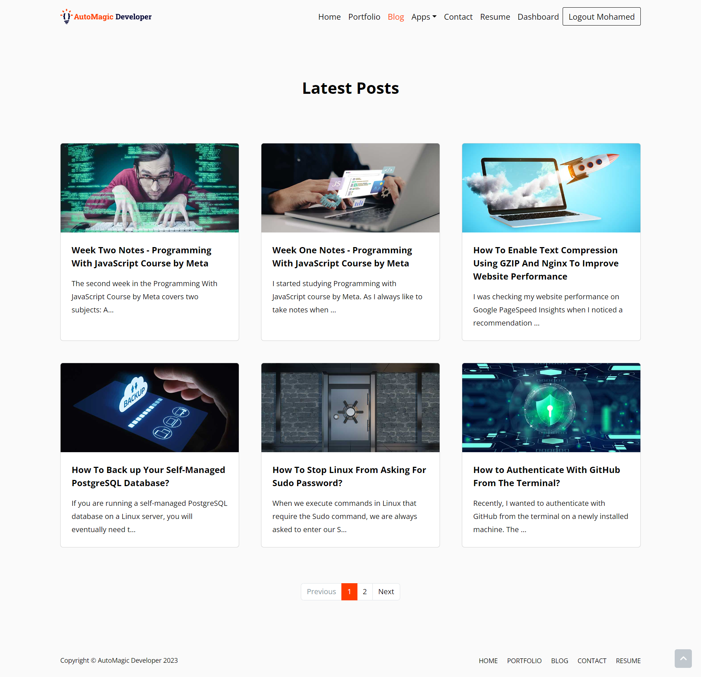
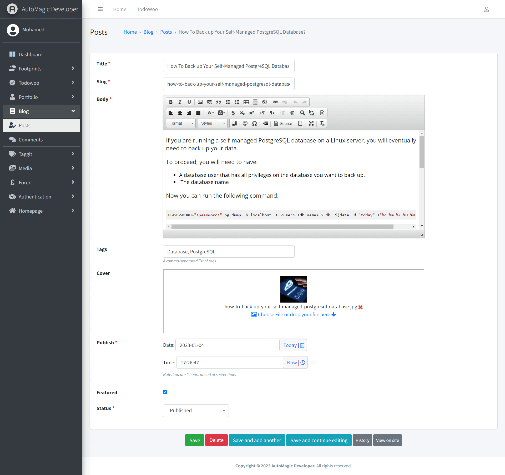
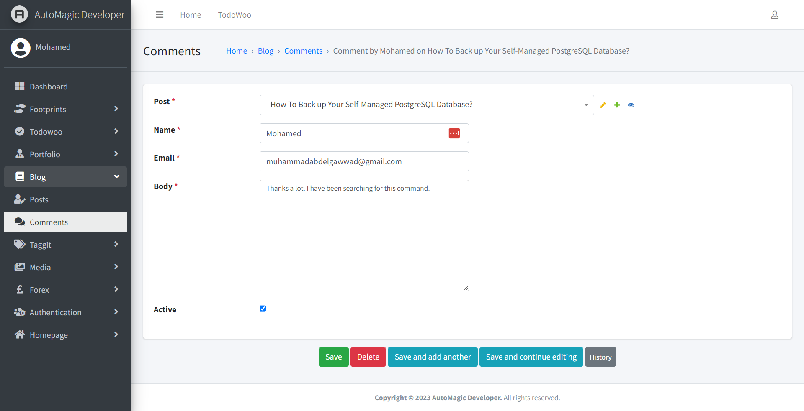
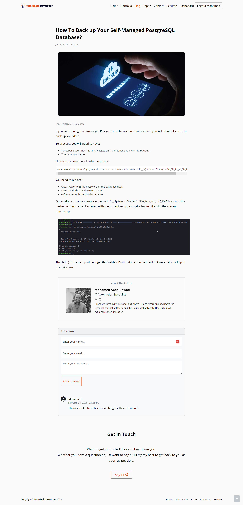

<!-- PROJECT SHIELDS -->
<!--
*** I'm using markdown "reference style" links for readability.
*** Reference links are enclosed in brackets [ ] instead of parentheses ( ).
*** See the bottom of this document for the declaration of the reference variables
*** for contributors-url, forks-url, etc. This is an optional, concise syntax you may use.
*** https://www.markdownguide.org/basic-syntax/#reference-style-links
-->

[![LinkedIn][linkedin-shield]][linkedin-url]

<!-- PROJECT LOGO -->
 

    

  <h3 align="center">Blog Web Application</h3>

<!-- TABLE OF CONTENTS -->

  
Table of Contents

  <ol>
    <li>
      <a href="#about-the-project">About The Project</a>
      <ul>
        <li><a href="#built-with">Built With</a></li>
      </ul>
    </li>
    <li><a href="#usage">Usage</a></li>
    <li><a href="#license">License</a></li>
    <li><a href="#contact">Contact</a></li>
  </ol>

<!-- ABOUT THE PROJECT -->
## About The Project

* Project Name: Blog Web Application
* Version: v1.0.0

### Description

A professional-grade Django web application that functions as a blog with 
features that allow users to browse and read posts, and an admin panel to add 
posts easily. 

The blog also includes an Author Box that helps readers connect with the writer, 
and a comments system that fosters interaction and engagement. 

In summary, the application supports the following features:
* A robust Django web application that serves as a blog.
* The blog features an elegant and intuitive user interface that enables users 
to browse and read posts effortlessly.
* An admin panel that allows blog owners to add posts with ease, thanks to 
the rich text box that generates formatted posts.
* The blog posts also feature an Author Box that showcases the author's profile, 
helping readers connect with the writer.
* The comments system is another feature that fosters interaction 
and engagement, making the blog more lively and dynamic.
* The application is secure and scalable, ensuring that it can handle high 
traffic and provide excellent user experience.

(<a href="#readme-top">back to top</a>)

### Built With

This project was developed using the following tech stacks:

* Python
* Django Backend Framework
* HTML
* CSS
* Bootstrap

(<a href="#readme-top">back to top</a>)

<!-- USAGE EXAMPLES -->
## Usage

### Screenshots

#### Add Post

#### Comments Model

#### Blog Post Page

(<a href="#readme-top">back to top</a>)

<!-- LICENSE -->
## License

Distributed under the MIT License. See `LICENSE.txt` for more information.

(<a href="#readme-top">back to top</a>)

<!-- CONTACT -->
## Contact

Mohamed AbdelGawad Ibrahim - [@m-abdelgawad](https://www.linkedin.com/in/m-abdelgawad/) - <a href="tel:+201069052620">+201069052620</a> - muhammadabdelgawwad@gmail.com

GitHub Profile Link: [https://github.com/m-abdelgawad](https://github.com/m-abdelgawad)

(<a href="#readme-top">back to top</a>)

<!-- MARKDOWN LINKS & IMAGES -->
<!-- https://www.markdownguide.org/basic-syntax/#reference-style-links -->
[linkedin-shield]: https://img.shields.io/badge/-LinkedIn-black.svg?style=for-the-badge&logo=linkedin&colorB=555
[linkedin-url]: https://www.linkedin.com/in/m-abdelgawad/
